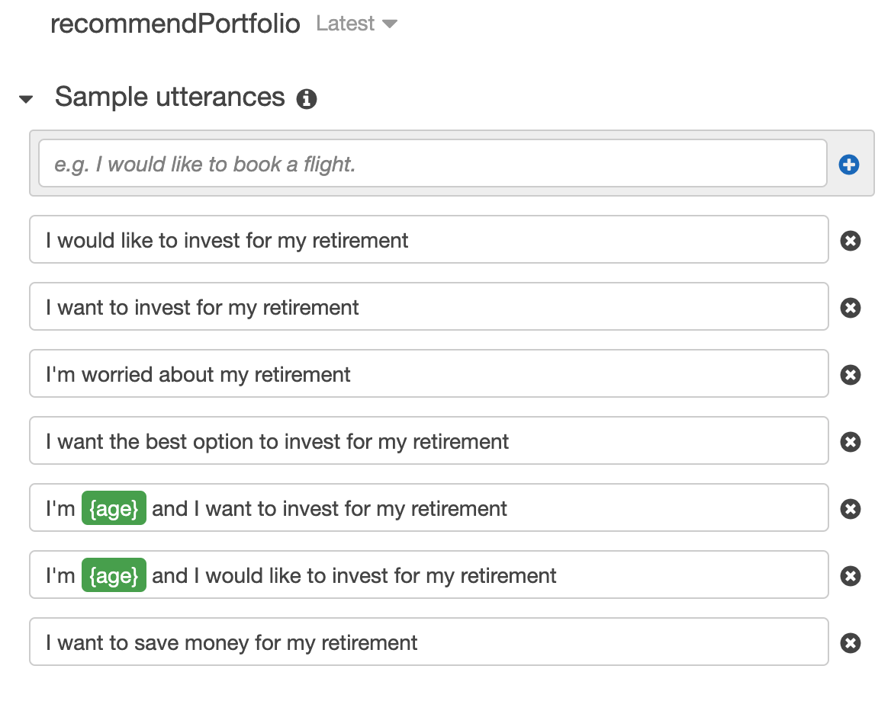
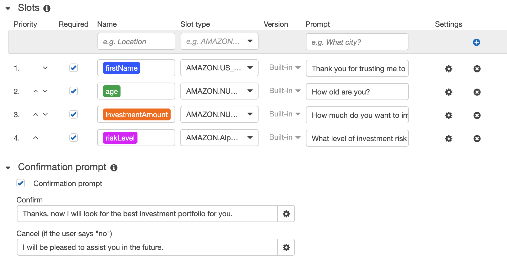
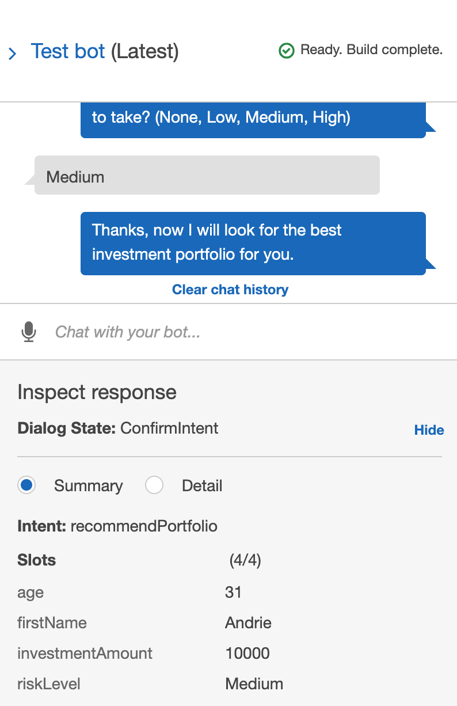
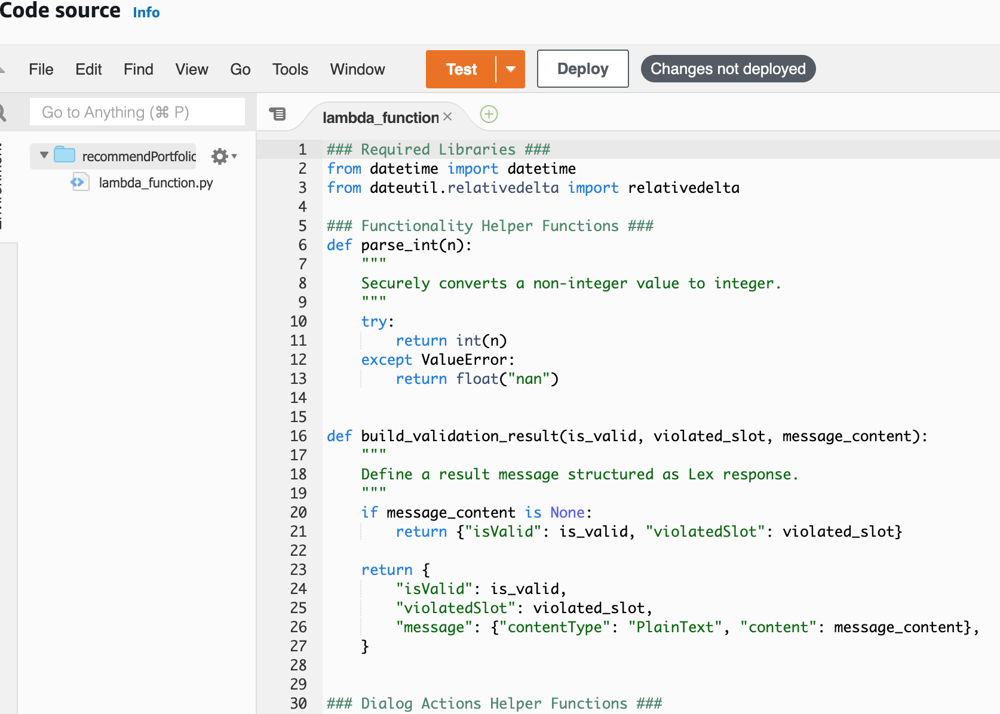
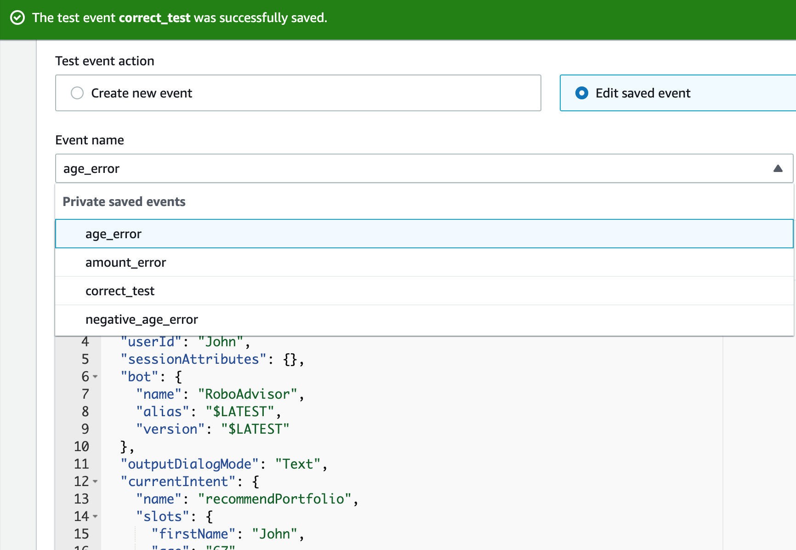
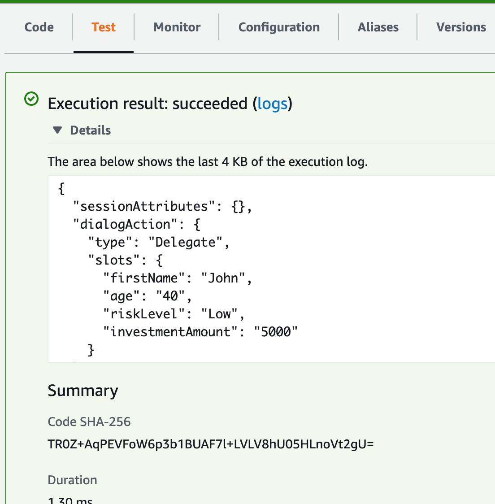
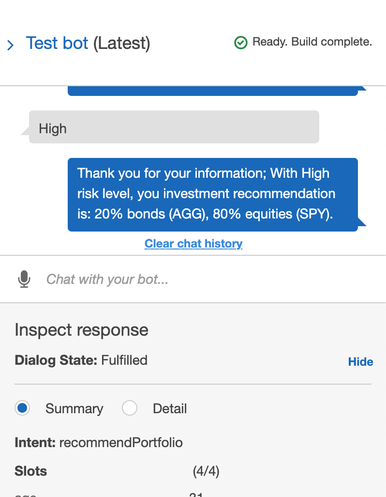

# AWS_RoboAdvisor
>To enhance customer experience, a 24/7 operating Robo Advisor was built, tested, and deployed leveraging AWS Lex, and Lambda functions.

Process incudes:

* [Configure the initial robo advisor](#configure-the-initial-robo-advisor)

* [Build and test the robo advisor](#tune-the-baseline-trading-algorithm)

* [Enhance the robo advisor with an Amazon Lambda function](#enhance-the-robo-advisor-with-an-amazon-lambda-function)

* [Test and deploy the robo advisor](#test-and-deploy-the-robo-advisor)

---

## Technologies
>This project leverages python 3.7

* [Lex](https://docs.aws.amazon.com/lex/latest/dg/what-is.html) - To build conversationa linterfaces for applications using voice and text

* [Lambda](https://docs.aws.amazon.com/lambda/latest/dg/welcome.html) - A compute service to run code on a high-availability compute infrastructure
---
## Building process
### Configure the initial robo advisor
-- Define an Amazon Lex bot with a single intent - 'recommendPortfolio' that establishes a conversation about requirements to suggest an investment portfolio for retirement.

* First of all, set up utterances.

* Next, define slots

### Build and test the robo advisor
-- After building the inital model, test to make sure that the bot works and accurately responds during the conversation with the user. A video demo is [here](recordings/test.mov).

### Enhance the robo advisor with an Amazon Lambda function
-- Create an Amazon Lambda function that validates the user's input and returns the investment portfolio recommendation. This includes testing the Amazon Lambda function and integrating it with the bot.

* Create functions

* Test functions with test cases

### Test and deploy the robo advisor
-- Test out all senarios including invalid answers to evaluate the full functionality of the bot, then deploy. A video demo with invalid answers is [here](recordings/error_input.mov). A video demo with valid answers is [here](recordings/correct.mov)

In conclusion:
Amazon Lex bot -- RoboAdvisor is powered by Amazon Lambda functions and it enables natual language interactions between human and machine. RoboAdvisor can accurately deliver recommended retirement investment plans based on user's age and risk tolerance.

---

## Contributors

UC Berkeley Extension

Brought you by **Yanjun Lin Andrie**

* yanjun.lin.andrie@gmail.com

* https://www.linkedin.com/in/yanjun-linked

---

## License

MIT